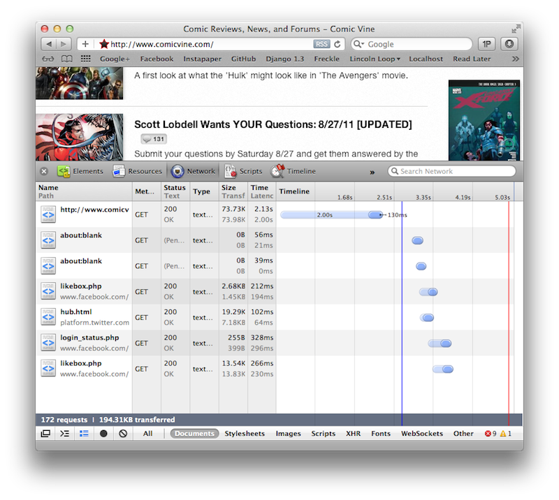
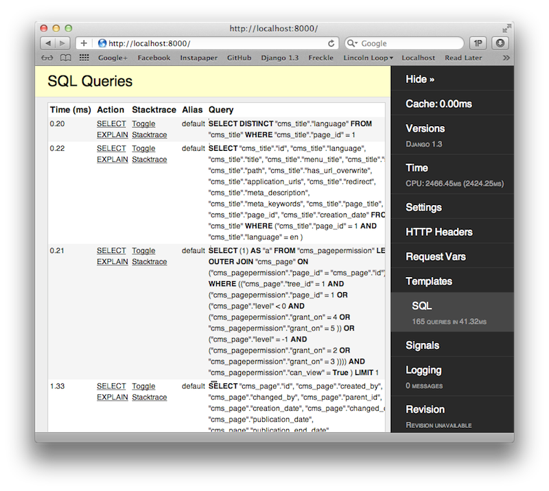
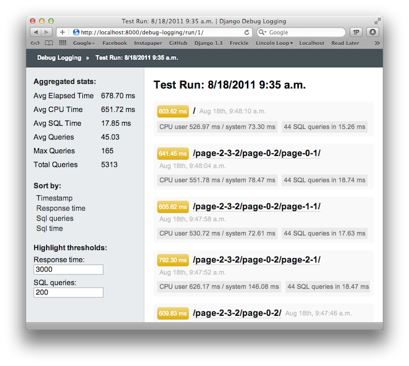
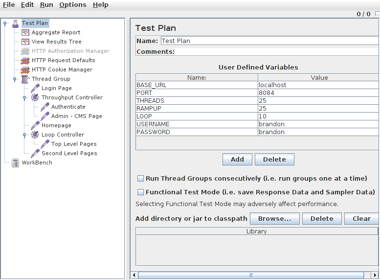
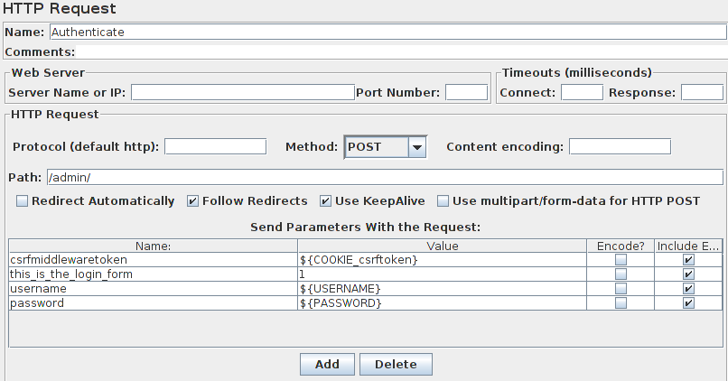

Stop Tilting At Windmills
=========================

.fx: intro

**Brandon Konkle**  <<brandon@lincolnloop.com>>

**Yann Malet**      <<yann@lincolnloop.com>>

DjangoCon 2011
Portland, OR

---

# Target Audience

* You have built one or more successful application
* You need to scale it to reach a larger audience

---

# Agenda

## Performance Testing

* Debug Toolbar
* Debug Logging
* Continuous testing

## Load Testing

* Jmeter
* Command-line tools

---

## This talk will not discuss

* How to optimize django apps
    * Optimizing queries
    * Caching
    * etc...

* How scale your infrastructure

---

# Django community's focus is evolving

## Where are we coming from?

* 2008 - Building reusable apps
* 2009, 2010 - Testing and continous integration

## Where are we (hopefully) going?

* Larger scale
* Better performance

---

# Tilting at Windmills

.fx: image

Like the brave but misguided Don Quixote we often charge after performance problems we think are monstrous,
 but turn out to be just minor issues.

---

# Example Django-CMS Site

We built few utilities on top of django-cms to:

* Create a dummy web site on demand
* Get the list of urls for the django-cms pages

---
# Performance Testing

.fx: intro

---

# Performance Testing

*"You can't manage what you don't measure"*

## What are we looking for?

* Time to load a page
* Number of queries per page
* Time taken by the queries
* Number of cache hits/misses
* Time spent waiting for external services

---

# Response Time

.fx: bigimage

---

# Response Time

## Pros

* No setup.
* Closest to the user experience.

## Cons

* It doesn't measure the internals of your application.
* It's a simple good/not good evaluation, with no clues about why.

---

# Django Debug Toolbar

.fx: bigimage

---

# Django Debug Toolbar

## Pros

* Provides a variety of information about what is going on inside.

## Cons

* Requires a third party application and some configuration.
* It's on demand.
* No history.

---

# Django Debug Logging

.fx: bigimage

---

# Django Debug Logging

## Pros

* Automated test covering a set of URLs
* Optimised for history tracking
* Repeatable process
* Provides aggregated data

## Cons

* Young project
* Requires another third party application and more configuration.

---

# Still A Work In Progress

At this stage it is a proof-of-concept. There are few outstanding issues and pending features.

* Better integration with django-debug-toolbar
* Support configurable log handlers, instead of just the database handler
* Optionally use unit tests instead of just url lists

---

# Continuous Testing

## Why?

* Helps narrow down the origin of performance problems
* Performance issues can't always be easily predicted
* Identify issues before they impact production

## How?

* Manually run performance test throughout the day
* Run periodically with cron
* Integrate with a tool like Jenkins

---

# Load Testing

.fx: intro

---

# Load Testing

* Taking your entire application infrastructure into account.
* Understanding how your performance changes under stress and over time.
* Creating realistic test plans that imitate real life traffic.

---

# What are we looking for?

## Database

* Handling numerous queries in parallel
* Types of queries running at the same time

## Caching

* Cache key expiration
* Cache size and key eviction

---

# What are we looking for? (Cont'd)

## Servers

* Memory utilization and swapping
* CPU load averages
* Balancing load effectively between database servers, app servers, utility servers, etc.

---

# Jmeter

* Use a GUI to plan out a load test with a huge variety of highly configurable components.
* Set up samplers for each view your users will access.
* Create text files with sample data that can be read by each sampler.
* Use post-processors to retrieve data from your responses, such as CSRF keys.
* Authenticate a Django user by taking the CSRF key from a GET request, then POSTing it along with your credentials.
* Use throughput controllers to define the percentage of traffic on each request type.

---
# Jmeter UI

.fx: bigimage

jmeter -p user.properties

---
# Jmeter CLI

jmeter -n -p user.properties -t windmill_plan.jmx -l results.jtl

---
# Anatomy of a POST

Working around [CSRF](https://docs.djangoproject.com/en/dev/ref/contrib/csrf/) protection

.notes: CSRF - This type of attack occurs when a malicious Web site contains a link, a form button or some javascript that is intended to perform some action on your Web site, using the credentials of a logged-in user who visits the malicious site in their browser.

---
# Command-Line Tools

* *htop* - An amplified version of *top* to review load averages, memory utilization, swapping, etc.
* *dstat* - Shows a variety of information about cpu, memory, disk, and network usage.
* *pg_top*, *mtop* - Displays databases statistics and the process list, allowing you to view details about individual queries.
* *memcache-top* - Retrieves statistics from multiple memcached instances, such as space used/free, hit percentage, evictions.

---

# Ressources - Performance analysis

* [Firebug](http://getfirebug.com/)
* [Django Debug Toolbar](https://github.com/django-debug-toolbar/django-debug-toolbar/)
* [Django Debug Logging](https://github.com/lincolnloop/django-debug-logging/)
* [Funkload](http://funkload.nuxeo.org/)
* [Bees with Machine Guns](https://github.com/newsapps/beeswithmachineguns)
* [Webunit](http://webunit.sourceforge.net/)
* [Grinder](http://grinder.sourceforge.net/)
* [Siege](http://www.joedog.org/index/siege-home)
* [Django Performance Patterns](http://morethanseven.net/2011/06/30/Django-performance-1-measuring-performance.html)

---

# Resources - Improving performance

* [Building Scalable Webapps](http://www.slideshare.net/zeeg/building-scalable-web-apps)
* [Switching Mozilla Addons to Django](http://blip.tv/djangocon/switching-addons-mozilla-org-from-cakephp-to-django-4125605)
* [Scaling Django Web Applications](http://blip.tv/djangocon/scaling-django-web-applications-3060922)
* [Django Performance Tips](http://jacobian.org/writing/django-performance-tips/)
[PostgreSQL Performance Tuning](http://www.revsys.com/writings/postgresql-performance.html)
* [Queryset Transform](https://github.com/simonw/django-queryset-transform)
* [Johnny Cache](http://packages.python.org/johnny-cache/)
* [Cachebot](https://github.com/dziegler/django-cachebot)
* [Cache Machine](http://jbalogh.me/projects/cache-machine/)

---

# Resources - Jmeter

* [User Manual](http://jakarta.apache.org/jmeter/usermanual/index.html)
* [Performance Testing with Jmeter](http://www.slideshare.net/agoucher/performance-testing-with-jmeter)
* [Jenkins Performance Plugin](https://wiki.jenkins-ci.org/display/JENKINS/Performance+Plugin)

---

# Questions?

.fx: break

## Brandon Konkle - @bkonkle
## Yann Malet - @gwadeloop